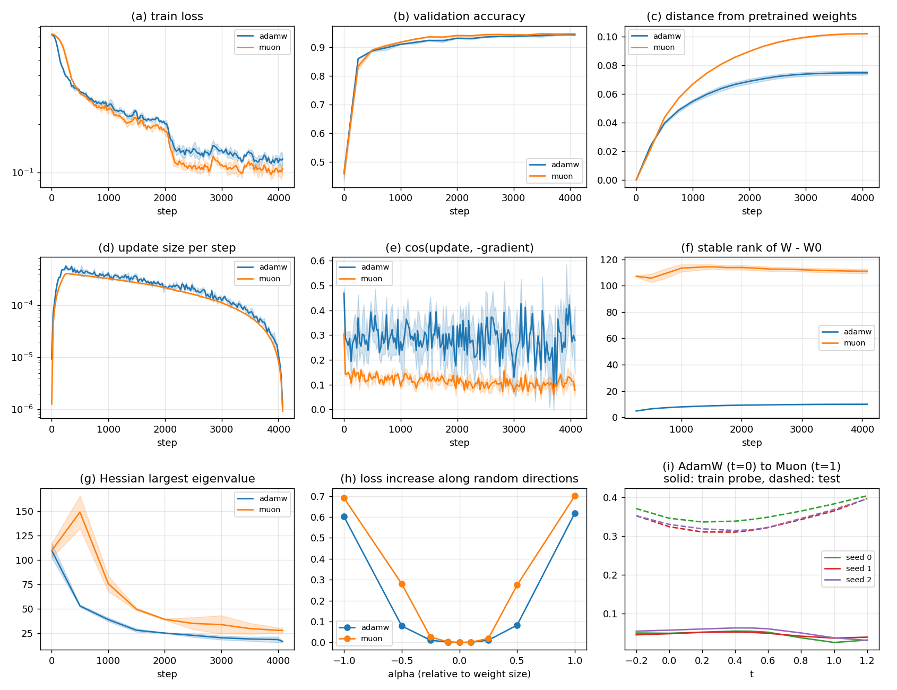

# AdamW vs Muon: Fine-Tuning BERT-small on SST-2

I fine-tune BERT-small on SST-2 with AdamW and with Muon under the same setup, then compare how they train and what solutions they reach.
Full write-up: [`report.pdf`](report.pdf)

## Results (3 seeds)

| | AdamW | Muon |
|---|---|---|
| Test accuracy (%) | 89.07 ± 0.40 | 88.69 ± 0.93 |
| Test loss | **0.333** | 0.372 |
| Time per step (ms) | **45.7** | 105.5 |
| Stable rank of weight change | 10 | 111 |
| Top Hessian eigenvalue | **16.7** | 28.0 |

* **Accuracy:** a tie.
* **Test loss and speed:** AdamW is better.
* **Weight changes:** Muon spreads its change over many more directions.
* **Flatness:** AdamW's solution is flatter by all four sharpness measures.

## How to run

1. Open `sst2_adamw_vs_muon.ipynb` in Google Colab.
2. Select a GPU: Runtime > Change runtime type > T4 GPU.
3. Click Runtime > Run all.

## Files

| File | Contents |
|---|---|
| `sst2_adamw_vs_muon.ipynb` | all code |
| `report.pdf` | write-up |
| `report/` | LaTeX source |
| `results/` | all metrics, tables and plots |

